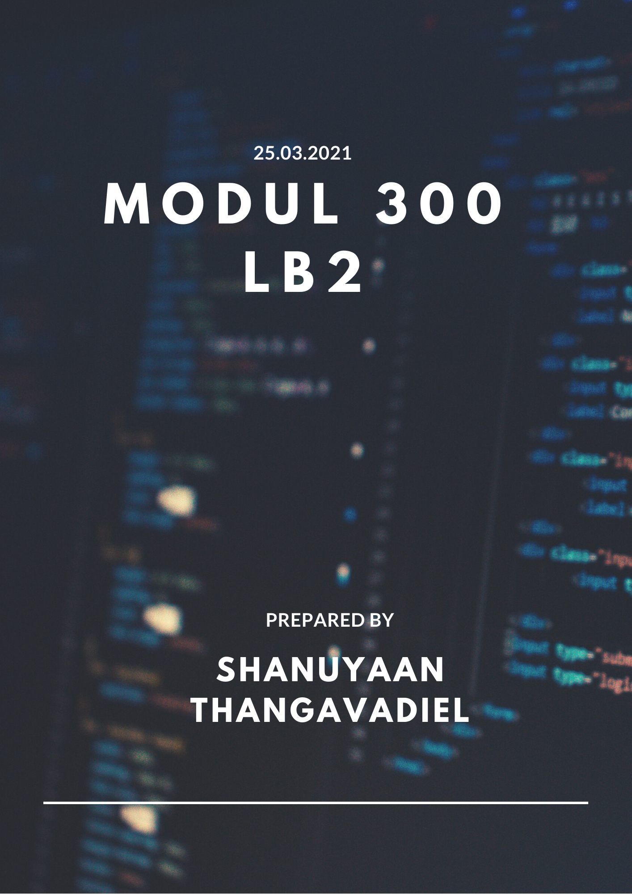

## Inhaltsverzechnis
1. [Einleitung](#Einleitung)
2. [Grafische Übersicht mit Visio](#Visio)
3. [Ablauf](#Ablauf)
4. [Code im Detail](#Code)
5. [Testen](#testen)
6. [Quellenverzechnis](#Quellen)

## Einleitung 

Im Modul 300 haben wir das Thema "Plattformübergreifende Dienste im Netzwerk integrieren" behandelt. Dazu haben wir ein Projekt gestartet. Zu Beginn haben wir die benötigte Tools installiert und getestet. Für unser Projekt müssen wir mit einem Repository arbeiten, in diesem Falle haben wir GitHub benutzt. Ausserdem brauchen wir ein IaC Tool, für das brauchen wir Vagrant.

In meinem Projekt erstelle ich ein Webserver mit Ubuntu. Die Umsetztung ist nicht sehr komplex., jedoch erfüllt es jegliche Anforderungen. Eine VM (Virtualbox) wird nach dem "vagrant up" Befehl gestartet. Danach wird ein Skript erstellt, welches die Systemprozesse anzeigt. Dazu kommt dass die Daten mit Hilfe eines Cronjob immer aktuell bleiben.

