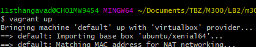
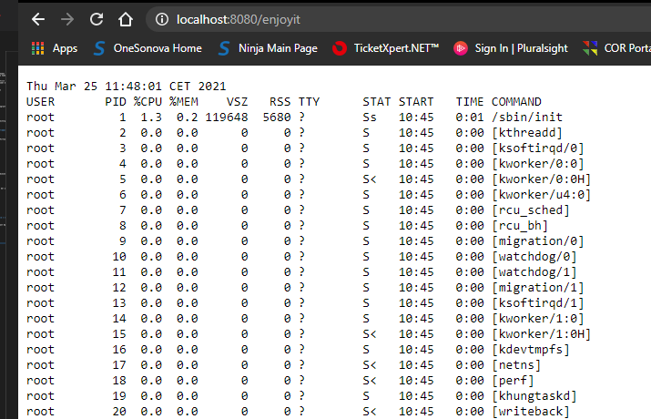
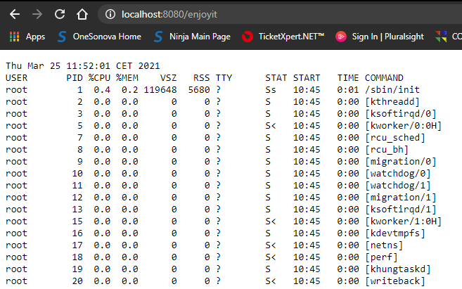

## Inhaltsverzechnis
1. [Einleitung](#Einleitung)
2. [Grafische Übersicht mit Visio](#Visio)
3. [Ablauf](#Ablauf)
4. [Code im Detail](#Code)
5. [Testen](#testen)
6. [Quellenverzechnis](#Quellen)

## Einleitung 

Im Modul 300 haben wir das Thema "Plattformübergreifende Dienste im Netzwerk integrieren" behandelt. Dazu haben wir ein Projekt gestartet. Zu Beginn haben wir die benötigte Tools installiert und getestet. Für unser Projekt müssen wir mit einem Repository arbeiten, in diesem Falle haben wir GitHub benutzt. Ausserdem brauchen wir ein IaC Tool, für das brauchen wir Vagrant.

In meinem Projekt erstelle ich ein Webserver mit Ubuntu. Die Umsetztung ist nicht sehr komplex., jedoch erfüllt es jegliche Anforderungen. Eine VM (Virtualbox) wird nach dem "vagrant up" Befehl gestartet. Danach wird ein Skript erstellt, welches die Systemprozesse anzeigt. Dazu kommt dass die Daten mit Hilfe eines Cronjob immer aktuell bleiben.

## Ablauf 

- In das Verzeichnis wo das Vagrantfile sich befindet, dann dort Git Bash starten und `vagrant up` eingeben

- Danach öffnet man eine Browser und gibt in der Suchleiste `http://localhost:8080/enjoyit` ein. 

- Mit `vagrant destroy` wird die Maschine gelöscht.

## Code im Detail 
>`Vagrant.configure(2) do |config|`  

Da wird die Konfiguration von der Vagrantbox gestartet. die **2** legt fest, dass die neuste Version von Vagrant verwendet wird.

>`config.vm.box = "ubuntu/xenial64"`  

Da wird das Betriebssystem der VM festgelegt, in diesem Falle eine **Ubuntu/Xenial 64-bit** Maschine.

>`config.vm.network "forwarded_port", guest:80, host:8080, auto_correct: true`  

Da wird die Portweiterleitung konfiguriert. Der Port 80 der VM wird auf den Port 8080 auf dem Hostsystem weitergeleitet. **auto_correct: true** legt fest, dass allfällige Kollisionen (z.B. falls Port 8080 auf dem Host bereits belegt ist) automatisch korrigiert werden.

>`config.vm.synced_folder ".", "/var/www/html"`  

Die Synchronisierten Ordner werden direkt mit dem Hostsystem synchronisiert, also sind die Files aus **/var/www/html** auch auf dem Hostsystem im Ordner mit dem Vagrantfile gespeichert werden.

>`config.vm.provider "virtualbox" do |vb|`  

Da wird der Hypervisor definiert, in diesem Fall **VirtualBox**. Da wird auch direkt die Konfiguration in VirtualBox gestartet.

>`vb.memory = "512"`  

Da wird der **Arbeitspeicher** der VM in MB definiert.

>`config.vm.provision "shell", inline: <<-SHELL`  

Die konfiguration in der Linux-Konsole wird gestartet.

>`sudo apt-get update`  
>`sudo apt-get -y install apache2`  

Der **Appkatalog wird aktualisiert** und der **Apache-Webservice wird installiert**.

>`cd /`  
>`mkdir bashscripts`  
>`cd bashscripts`  

Es wird in das Root-Verzeichnis gewechselt und ein neuer Ordner **/bashscripts** erstellt, danach wird in diesen Ordner gewechselt.

>`touch dateproc.sh`  

Ein neues **Shell-Script wird angelegt**.

>`echo "env TZ=CET-1 date > /var/www/html/processes" > dateproc.sh`  

Das aktuelle Datum in Zentral-Europäsischer Zeit wird in das File **/var/www/html/processes** geschrieben, der aktuelle Inhalt wird überschrieben.

>`echo "ps aux >> /var/www/html/processes" >> dateproc.sh`  

Die aktuellen Systemprozesse werden ins File **/var/www/html/processes** appendiert.

>`chmod +x /bashscripts/dateproc.sh`  

**Executable-Rechte** werden auf das Script gegeben.

>`./dateproc.sh`  

Das Script wird initial ausgeführt, um direkt Ergebnisse zu erhalten.

>`crontab -l | {  cat; echo "*/2 * * * * /bashscripts/dateproc.sh"; } | crontab -`  

Ein Cronjob für das automatische Ausführen des Scripts wird erstellt. Das Skript wird duch das Format **"*/2 * * * * /bashscripts/dateproc.sh"** alle zwei Minuten ausgeführt.

## Testen 

Zuerst öffnen sie das Verzeichnis in dem das Vagrantfile befindet und starten anschliessen Git Bash. Danach Befehl "Vagrant Up" eingeben:

Danach geben Sie den Link im Browser ein und öffnen die Seite. 

Nach erneutem Laden sieht man, dass sich die Zeit geändert hat.

## Quellenverzeichnis 

- M300 Web-Template link: (https://github.com/mc-b/M300/tree/master/vagrant/web)

- Markdown Basic Syntax Link: (https://www.markdownguide.org/basic-syntax/)

- Cronjob Link: (https://stackoverflow.com/questions/878600/how-to-create-a-cron-job-using-bash-automatically-without-the-interactive-editor)

- Zeitzonen Command Link: (https://unix.stackexchange.com/questions/48101/how-can-i-have-date-output-the-time-from-a-different-timezone)